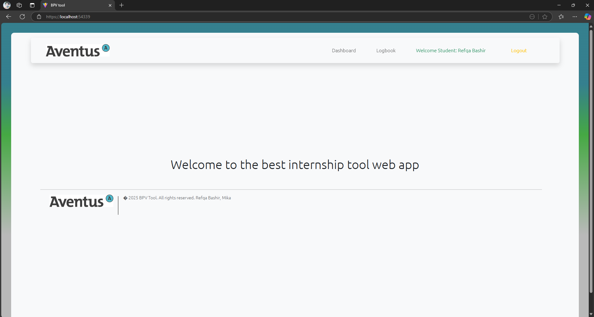

# BPV Tool

A web platform for students and teachers to easily manage the BPV process (work placement training).

---

## 📋 **Overview**
This tool helps students upload internship files, track hours and monitor progress. At the same time, teachers and work placement supervisors can assess the submitted files and provide feedback.





---

## 🔥 **Features (current epics)**
✅ Epic 1: Process automation
- Students start their BPV process and register company details and supervisors.
- Teachers/work placement supervisors approve or reject steps.

✅ Epic 2: File management
- Students upload files per step.

- Teachers provide feedback and approve or reject submissions.
- Students download all files as a ZIP file.

✅ Epic 5: Logbook & Time Registration
Students log worked hours with date + activity.
Teachers can view student logbooks.

✅ Epic 7: Security & Roles

Secure login with JWT tokens.

Role management (Admin, Teacher, Student) with access control.

---

## 🛠️ Techniques & Stack

- Frontend: React.js + Bootstrap

- Backend: .NET 8 Web API (C#)

- Database: Entity Framework Core + SQL Server

- Authentication: JWT + Role-based authorization

- Files: Upload to server folder (/BPVfiles) + ZIP downloads

- Project tools: Visual Studio, Azure DevOps, GitHub, Figma

## 🏗️ Installation (for developers)

1. **Clone project**

```bash
git clone https://github.com/AventusCT/4-april-mei-sld-refqa-mika.git
cd bpv-tool
```

2. **Configure database**
Adjust your SQL Server connection in appsettings.json:

```json
"ConnectionStrings": { 
"DefaultConnection": "Server=localhost;Database=BPVToolDB;Trusted_Connection=True;"
}

```
3. **Run EF Core migrations**

```bash
cd BPV_tool.Server
dotnet ef database update

```

4. **Start backend API**

```bash
dotnet run --project BPV_tool.Server
```

5. **Start frontend**

```bash
cd bpv_tool.client
npm install
npm run dev
```

## 📝 **Project structure**

```bash
BPV_tool.Server # .NET 8 Web API backend
bpv_tool.client # React frontend
BPVfiles/ # Uploads per student (e.g. /BPVfiles/john_doe_GUID)
readmeImages/ # Images for this README
```

## 🌐 **API Routes (current features)**

| Route | Method | Roles | Description |
|-------------------------------------|---------|--------------------------|-----------------------------------------------|
| `/api/Auth/login` | POST | All | Login (receive JWT token) |
| `/api/StudentDashboard/processes` | GET | Student | View own BPV processes |
| `/api/StudentDashboard/processes` | POST | Student | Start new BPV process |
| `/api/StudentDashboard/processes/{id}/steps` | GET | Student/Teacher/Admin | View steps |
| `/api/StudentDashboard/processes/{pId}/steps/{sId}/upload` | POST | Student | Upload file for step |
| `/api/StudentDashboard/processes/{pId}/steps/{sId}/approve` | POST | Teacher | Approve step + give feedback |
| `/api/StudentDashboard/download-zip`| GET | Student | Download all submitted files as ZIP |

## ✅ **Requirements**

- .NET 8 SDK
- Node.js 18+
- SQL Server
- Visual Studio 2022 (recommended)

## 📝 **Future Epics**

- Epic 3: Add assessment forms
- Epic 4: Progress insights for students and teachers
- Epic 6: Gamification with badges and notifications

## 🔒 **Security & Privacy**
- JWT authentication with role-based authorization (Admin, Teacher, Student)
- Files uploaded in secure folder per student

## 🧑‍💻 **Team & Credits**

- Refqa
- Mika
- Client: Aventus BPV department

Deadline: 06-05-2025

## 💪 **Status: Active (epics 1,2,5,7 in progress...)**
Mika still needs to work on teacher dashboard with assignments approval.
